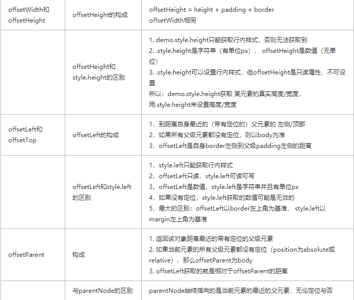
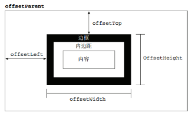
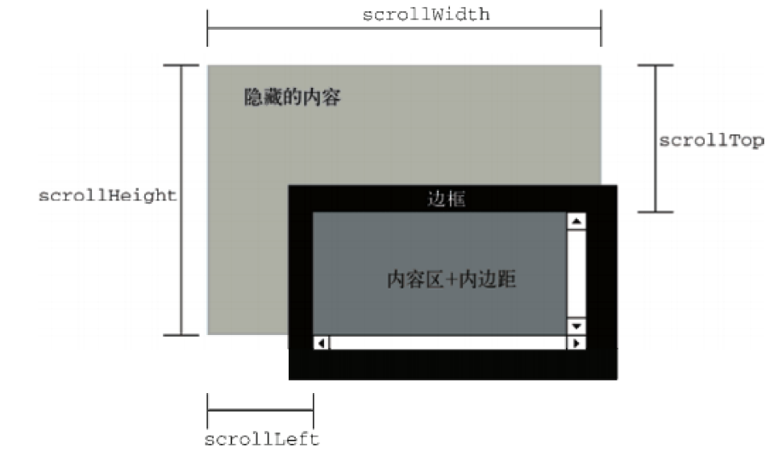

## BOM基础知识
 #### 什么是BOM
   - BOM 即浏览器对象模型
   - BOM提供了独立于内容而与浏览器窗口进行交互对象
   - 由于BOM主要用于管理窗口与窗口之间的通讯，核心是window
   - BOM由一系列相关的对象构成，并且为每个对象提供了很多方法与属性

#### BOM 对象
 <div align="center">
  
 </div>

#### window对象
  - window对象是js中的顶级对象，所有定义在全局作用域中的变量，函数都会变成window对象的属性和方法，在调用的时候可以省略window
  ```
   window.open(url,target,param)
   window.close()
  ```
  - 定时器
  - setTimeout() // clearTimeout()
  - setInterval() // clearInterval()
  - offset系列方法
    <div align="center">
      
    </div>
    ---
    ---  
   <div align="center">
      
    </div>
    
  - scroll系列方法
    - scrollHeight和scrollWidth:对象内部的实际内容的高度/宽度（不包括border）
    - scrollTop和scrollLeft：被卷去的部分顶部/左侧到可视区域 顶部/左侧的距离
    - onscroll事件：滚动条滚动触发的事件
    - 页面滚动坐标：var scrollTop=window.pageYoffset || document.documentElement.scrollTop || document.body.scrollTop || 0
      <div align="center">
        
       </div>

 - client系列
   - clientX和clientY：获取鼠标在可视区域的位置 clientX=width+padding ,clientY=height+padding
   - clientLeft: 边框的宽度，若有滚动条的话，包括滚动条
     <div align="center">
      
     </div>
    ```
      function client() {
            return {
                clientWidth: window.innerWidth || document.body.clientWidth || document.documentElement.clientWidth || 0;
                clientHeight: window.innerHeight || document.body.clientHeitght || document.documentElement.clientHeight || 0;
            };
         }
    ```
- 事件参数e
  当事件发生的时候，系统会自动给事件处理函数传递一个参数，会提供事件相关的一些数据，事件参数e浏览器的兼容性检测：e=e || window.event
  e.pageX和e.pageY: 获取鼠标在页面中的位置 | pageX=clientX+页面滚动出去的距离

- 获得计算后样式的方法
  - w3c标准:window.getComputedStyle(element,null)
  - IE浏览器:element.currentStyle
  - 封装浏览器兼容性函数
    ```
        function getStyle(el,attr){
             if(window.getComputedStyle) {
            return window.getComputedStyle(element, null)[attr];
        } else {
            return element.currentStyle[attr];
        }
        }
    ```
  - 事件补充
    - 注册事件
    - 注册事件的性能问题
    - 移除事件
    - 事件冒泡
      - 用addEventListener注册事件的时候,第三个参数是false，即是冒泡
      ```
        ul.addEventLsitener("click",test,false)
        function test(e){
            alert(e.target.innerText            )
        }
      ```
      - 当事件冒泡影响了其他功能时，需要阻止冒泡
      ```
      //阻止冒泡
       e.stopPropagation()  IE8之前：event.cancleBubble=true
       // 阻止默认行为的执行
       event.preventDefault() IE8及之前: event.returnValue = false
      ```
    - 事件捕获 事件的三个阶段
    - 事件对象的常见属性
     - target:始终是点击的元素
     - currentTarget：执行事件处理函数的元素
     - this: 始终和currentTarget一样
    - 鼠标事件的参数
     - e.type ： 事件的类型如:click ,mouseover
     - 事件的3个阶段：1捕获阶段 2目标阶段 3冒泡阶段
     - e.eventPhase：事件阶段
     - button
     - shiftKey/ctrKey/altKey:按下鼠标同时按下组合键
     - button：获取鼠标的按键
     - e.clentX和e.clientY:获取鼠标在可视区域的位置
